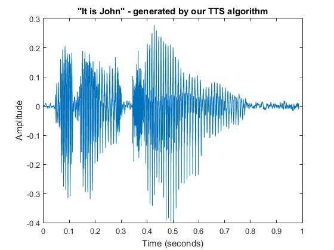
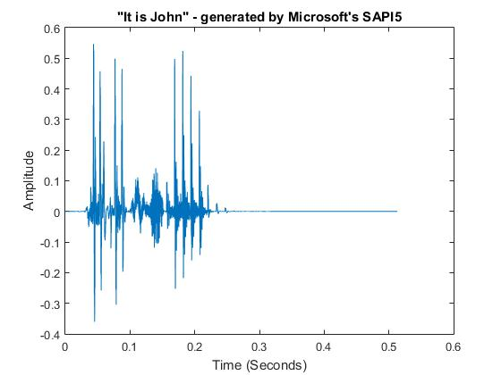

# TTSBOX-Text-to-Speech-Conversion
Using the MATLAB toolbox for TTS Conversion by Hidden Markov Models based Unit Selection and Concatenative Synthesis.

All rights to the toolbox go to:

1.T. Dutoit and M. Cernak, "TTSBOX: a MATLAB toolbox for teaching text-to-speech synthesis," Proceedings. (ICASSP '05). IEEE International Conference on Acoustics, Speech, and Signal Processing, 2005., Philadelphia, PA, 2005, pp. v/537-v/540 Vol. 5, doi: 10.1109/ICASSP.2005.1416359.

<u>Work Done:</u>

1. Put together the various features in the toolbox to implement text to speech conversion
2. Run tts_run.m to run our code
3. Brief Summary of our work can be read in the summary.pdf

